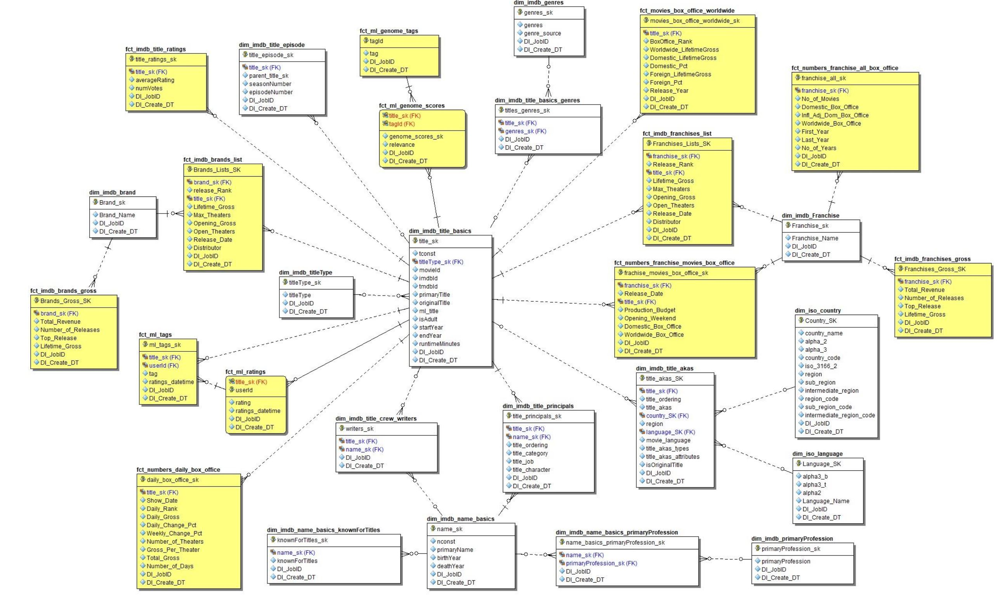

# IMBD_DataIntegration_Talend
## IMDb Datasets
IMDb Dataset DetailsEach dataset is contained in a gzipped, tab-separated-values (TSV) formatted file in the UTF-8 character set. The first line in each file contains headers that describe what is in each column. A‘\N’is used to denote that a particular field is missing or null for that title/name. The available datasets are as follows:   
<b>title.akas.tsv.gz</b>-Contains the following information for titles: 
▪titleId(string) -a tconst, an alphanumeric unique identifier of the title 
▪ordering (integer) –a number to uniquely identify rows for a given titleId 
▪title (string) –the localized title 
▪region (string) -the region for this version of the title 
▪language (string) -the language of the title 
▪types (array) -Enumerated set of attributes for this alternative title. One or more of the following: "alternative", "dvd", "festival", "tv", "video", "working", "original", "imdbDisplay". New values may be added in the future without warning 
▪attributes (array) -Additional terms to describe this alternative title, not enumerated   
<b>title.basics.tsv.gz</b>-Contains the following information for titles: 
▪tconst(string) -alphanumeric unique identifier of the title 
▪titleType(string) –the type/format of the title (e.g. movie, short, tvseries, tvepisode, video, etc) 
▪primaryTitle(string) –the more popular title / the title used by the filmmakers on promotional materials at the point of release 
▪originalTitle(string) -original title, in the original language 
▪isAdult(boolean) -0: non-adult title; 1: adult title 
▪startYear(YYYY) –represents the release year of a title. In the case of TV Series, it is the series start year 
▪endYear(YYYY) –TV Series end year. ‘\N’ for all other title types 
▪runtimeMinutes–primary runtime of the title, in minutes 
▪genres (string array) –includes up to three genres associated with the title   
<b>title.crew.tsv.gz</b>–Contains the director and writer information for all the titles in IMDb. Fields include: 
▪tconst(string) -alphanumeric unique identifier of the title 
▪directors (array of nconsts) -director(s) of the given title 
▪writers (array of nconsts) –writer(s) of the given title   
<b>title.episode.tsv.gz</b>–Contains the tv episode information. Fields include: 
▪tconst(string) -alphanumeric identifier of episode 
▪parentTconst(string) -alphanumeric identifier of the parent TV Series 
▪seasonNumber(integer) –season number the episode belongs to 
▪episodeNumber(integer) –episode number of the tconstin the TV series   
<b>title.principals.tsv.gz</b>–Contains the principal cast/crew for titles 
 ▪tconst(string) -alphanumeric unique identifier of the title 
 ▪ordering (integer) –a number to uniquely identify rows for a given titleId 
 ▪nconst(string) -alphanumeric unique identifier of the name/person 
 ▪category (string) -the category of job that person was in 
 ▪job (string) -the specific job title if applicable, else '\N' 
 ▪characters (string) -the name of the character played if applicable, else '\N'   
<b>title.ratings.tsv.gz</b>–Contains the IMDb rating and votes information for titles 
▪tconst(string) -alphanumeric unique identifier of the title 
▪averageRating–weighted average of all the individual user ratings 
▪numVotes-number of votes the title has received   
<b>name.basics.tsv.gz</b>–Contains the following information for names: 
▪nconst(string) -alphanumeric unique identifier of the name/person 
▪primaryName(string)–name by which the person is most often credited 
▪birthYear–in YYYY format 
▪deathYear–in YYYY format if applicable, else '\N' 
▪primaryProfession(array of strings)–the top-3 professions of the person 
▪knownForTitles(array of tconsts) –titles the person is known for   
## IMDb Datasets –ISO Datasets 
•<b>Countries:</b>countries_iso-all.tsv 
•<b>Languages:</b>language-codes-iso.tsv   
## IMDb Datasets –Box Office Revenues 
•<b>World Wide Box Office All Time Top 1000 Movies:</b>World Wide Box Office All Time Top 1000.tsv 
•<b>Top Movie Franchises</b> 
▪IMDb BoxOfficeMojo-Franchises (US & Canada).tsv–aggregate data for all franchises 
▪IMDb BoxOfficeMojo-Franchise_ Marvel Cinematic Universe.tsv–data for one franchise 
▪You need to extract & load data for top 20 franchises 
•<b>Top Movie Brands</b> 
▪IMDb BoxOfficeMojo-Brands (US & Canada).tsv-aggregate data for all brands 
▪IMDb BoxOfficeMojo-Brand_ Marvel Comics.tsv–data for one brand 
▪Youneedto extract & load data for top 20 brands   
## Movie Lens Data 
This dataset (ml-25m) describes 5-star rating and free-text tagging activity from [MovieLens](http://movielens.org), a movie recommendation service. It contains 25,000,095 ratings and 1,093,360 tag applications across 62,423 movies. These data were created by 162,541 users between January 09, 1995 and November 21, 2019. This datasetwas generated on November 21, 2019.Description: MovieLens_README.txt 
•Movies Data File Structure (MovieLens_ movies.csv) 
•Ratings Data File Structure (MovieLens_ ratings.csv) 
•Tags Data File Structure (MovieLens_ tags.csv) 
•Links Data File Structure (MovieLens_ links.csv) 
•Tag Genome (MovieLens_ genome-scores.csv and MovieLens_ genome-tags.csv)   
## The Numbers 
•<b>Obtaining daily box office data on franchises & their movies by cut & past</b> 
▪Franchises Domestic Box Office 
▪Box Office History for Marvel Cinematic Universe Movies 
▪The Avengers (2012) 
•<b>Files</b> 
▪The Numbers -Domestic Box Office -Franchises.tsv 
▪The Numbers -Domestic Box Office -Franchises -Marvel Cinematic Universe.tsv 
▪The Numbers -Domestic Box Office Daily -The Avengers.tsv   
## IMDb Project Deliverables 
>•Ingest initial set of tsvor csv files into staging tables 
>•Design and load dimensional model for above data 
>•Perform data consistency & cleansing processes 
>•Add supplemental data to model 
>•Design and create BI visualizations answering business questions   
## Dimensional Model 
 
